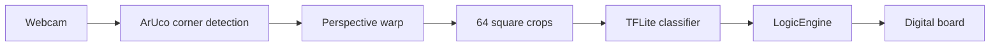

# Chess-Vision

Play chess on a real board and let your webcam keep score.

Chess-Vision watches a physical chess set through a camera. Four ArUco markers on the corners tell it where the board is; the feed gets warped to a top-down view, and a small TensorFlow Lite model classifies each square as empty, white, or black. When you make a move and hit Space, the app figures out what changed, checks it against [python-chess](https://python-chess.readthedocs.io/), and prints the result in standard algebraic notation.

Alongside the camera feed, a **digital board** window shows the game state with piece images — handy when you want to double-check what the system thinks is on the board without squinting at the warped view.

## How it works



1. **Find the board** — Four ArUco markers (`DICT_4X4_50`, IDs `0`–`3`) sit on the corners. Their inner corners define a homography that warps the camera feed into an 800×800 board image.
2. **Read each square** — All 64 squares are cropped, resized, and run through `model.tflite`, which labels them `empty`, `black`, or `white` (see `labels.txt`).
3. **Detect moves** — Once a game is started, Space compares the current snapshot to the last one, guesses the from/to squares from occupancy changes, and accepts the move if it's legal.
4. **Update the digital board** — After you start a game or register a move, a Tkinter window redraws the position using PNG piece images from `chesspics/`.

Corner positions are saved to `calibration.json` when you freeze tracking, so you don't have to recalibrate every session.

## What you need

- Python 3.10+ (tested on 3.12)
- A webcam
- A physical board with four ArUco markers on the corners (`4x4_50` dictionary, IDs `0`–`3`)
- Piece images in `chesspics/` (used by the digital board — `wK.png`, `bQ.png`, and the rest of the standard set)

Install dependencies:

```bash
pip install opencv-python numpy python-chess ai-edge-litert pillow
```

| Package | What it does |
|---------|--------------|
| `opencv-python` | Camera, ArUco detection, warping, OpenCV windows |
| `numpy` | Geometry and array math |
| `python-chess` | Board state, legality checks, SAN |
| `ai-edge-litert` | Runs `model.tflite` |
| `pillow` | Loads and resizes piece images for the digital board |

## Files worth knowing

| File | What it is |
|------|------------|
| `vision_updated.py` | Main app — camera loop, controls, ties everything together |
| `digital_board.py` | Tkinter window that renders the current position |
| `occupancy_colour_ml.py` | TFLite wrapper for per-square classification |
| `logic.py` | Game state, move detection, legality |
| `model.tflite` | Trained classifier (empty / black / white) |
| `labels.txt` | Model class labels |
| `chesspics/` | Piece PNGs for the digital board |
| `calibration.json` | Saved corner points (created when you freeze the board) |

## Getting started

1. Clone the repo and install the packages above.
2. Put ArUco markers `0`–`3` on the board corners so the camera can see all four.
3. If your webcam isn't device index `1`, change `CAMERA_INDEX` at the top of `vision_updated.py`.
4. Run:

```bash
python vision_updated.py
```

You'll get three windows:

- **Camera** — live feed with a blue outline when the board is found
- **Board** — warped top-down view with a grid (once tracking works)
- **Chess Vision Digital Board** — the piece-image board, starting from the initial position and updating as you play

You can also run the digital board on its own to preview the starting position:

```bash
python digital_board.py
```

## Controls

| Key | What it does |
|-----|--------------|
| **Shift+S** | Start a new game from the current board snapshot |
| **Space** | Classify the board and try to register a move (game must be started) |
| **s** | Freeze tracking and save calibration to `calibration.json` |
| **r** | Turn live tracking back on |
| **q** | Quit |

**Typical session**

1. Point the camera at the board until all four markers show up (blue outline on **Camera**).
2. Press **s** when the warped **Board** view looks aligned — this saves calibration and stops the warp from drifting.
3. Set up the pieces, then **Shift+S** to start the game. The digital board snaps to match.
4. Make a move on the real board, press **Space**, and check the terminal for `[MOVE] e4` (or `[ILLEGAL]` if something went wrong). The digital board updates on successful moves.

If you hit Space before starting a game, you'll see `[ERROR] Press Shift+S first`.

## ArUco marker layout

Markers use OpenCV's `DICT_4X4_50` with IDs `0`–`3`. Each marker's **inner** corner pins one board corner:

| Marker ID | Corner |
|-----------|--------|
| 0 | Bottom-right |
| 1 | Bottom-left |
| 2 | Top-left |
| 3 | Top-right |

All four need to be visible at least once before warping works. After you freeze with **s**, tracking can stay off while you play.

## What the model actually sees

Per square, the classifier returns:

- `state` — `"empty"`, `"black"`, or `"white"`
- `confidence` — normalized score
- `empty_score`, `black_score`, `white_score` — raw class scores

Vision only tells us *whether* a square has a white piece, a black piece, or nothing. Piece *types* (pawn vs knight, etc.) come from the internal game state in `logic.py`, seeded from `STARTING_PIECES` — not from the camera.

## When things go wrong

- **No Board window** — All four ArUco markers need to be in view, with the right IDs (`0`–`3`).
- **Digital board missing pieces** — Check that the PNGs exist in `chesspics/` (e.g. `wK.png`, `bP.png`).
- **Wrong camera** — Tweak `CAMERA_INDEX` in `vision_updated.py`.
- **Warp drifts** — Press **s** again to re-freeze and overwrite `calibration.json`.
- **Move not detected** — Only change one move at a time before Space; at least two squares need to differ between snapshots.
- **Illegal move** — Lighting, piece contrast, or a misaligned grid can confuse the classifier. Glance at the digital board to see what the system thinks is on the board.
